# Quiz Base

<p align="center">
  A real-time multiplayer quiz platform with private rooms, matchmaking, category voting, power-ups, social features and player statistics.
</p>

<p align="center">
  
  
  
  
  
  
</p>

## Overview

Quiz Base is a full-stack multiplayer quiz application built around real-time communication. Players can create a private room, invite others with a six-character code or link, join automatic matchmaking and compete through several timed rounds.

Each round begins with category voting and continues with a configurable number of questions. Faster correct answers receive more points, while optional power-ups add a strategic layer to the game. Registered users can also build a friends list, send game invitations and review their game history and statistics.

The user interface is currently available in Polish.

## Screenshots

### Home page

<p align="center">
  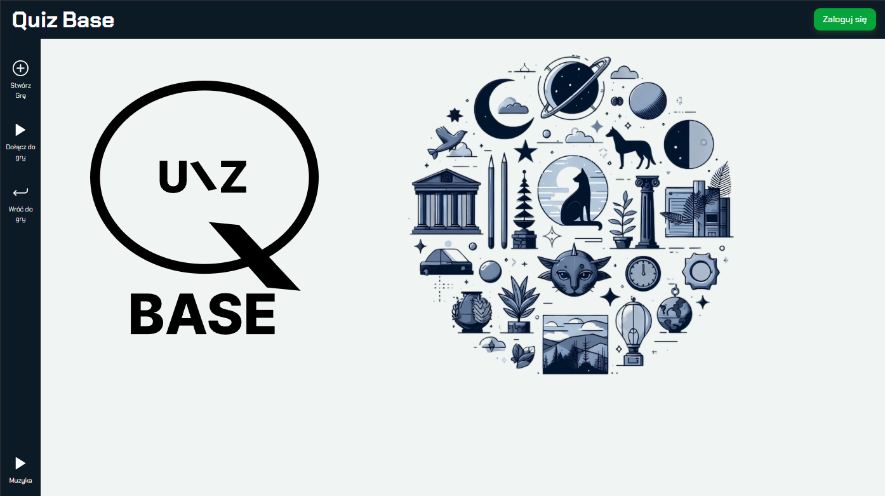
</p>

<details>
  <summary>Mobile view</summary>
  <p align="center">
    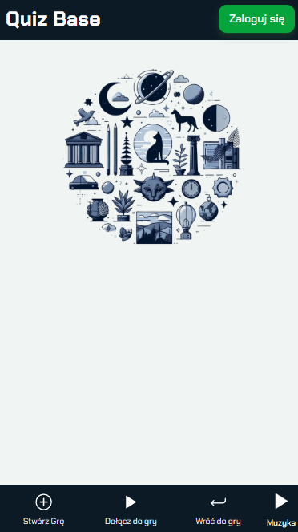
  </p>
</details>

### Accounts and gameplay

<table>
  <tr>
    <td align="center"><strong>Login</strong></td>
    <td align="center"><strong>Registration</strong></td>
  </tr>
  <tr>
    <td>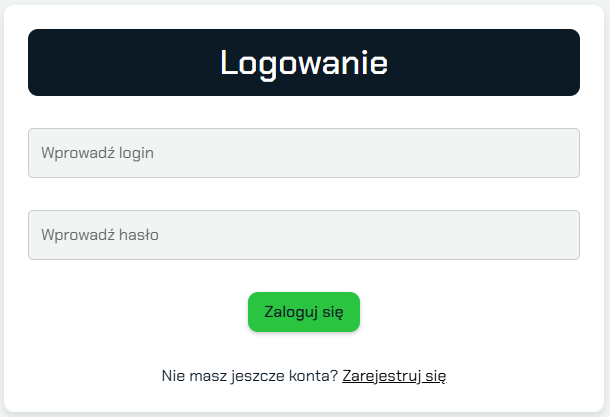</td>
    <td>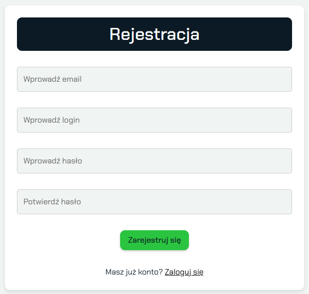</td>
  </tr>
  <tr>
    <td align="center"><strong>Game settings</strong></td>
    <td align="center"><strong>Category voting</strong></td>
  </tr>
  <tr>
    <td>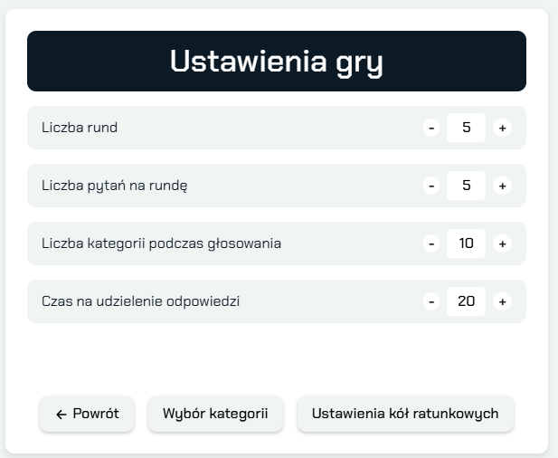</td>
    <td>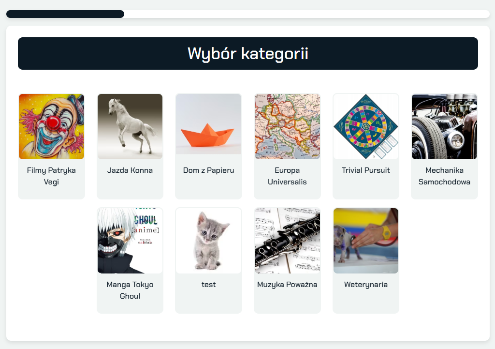</td>
  </tr>
  <tr>
    <td align="center"><strong>Selected category</strong></td>
    <td align="center"><strong>Answer result</strong></td>
  </tr>
  <tr>
    <td>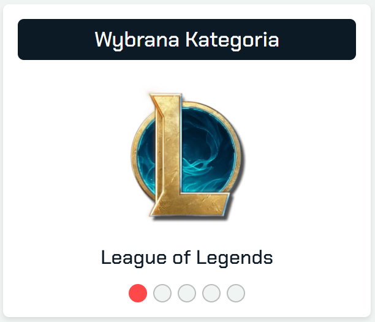</td>
    <td>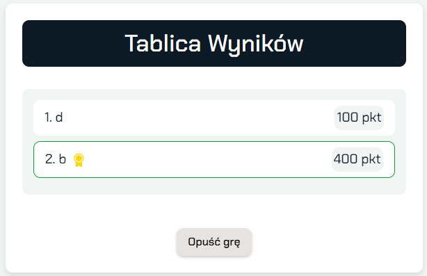</td>
  </tr>
</table>

### Profile and statistics

<table>
  <tr>
    <td align="center"><strong>Player profile</strong></td>
    <td align="center"><strong>Player statistics</strong></td>
  </tr>
  <tr>
    <td>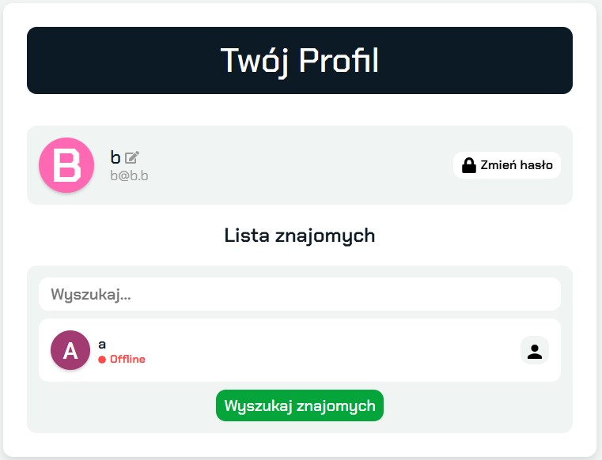</td>
    <td>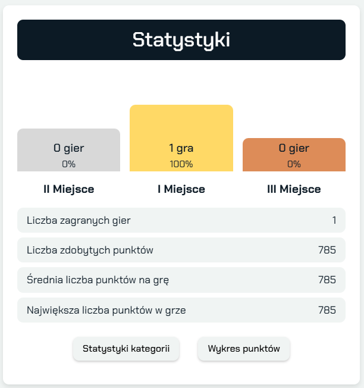</td>
  </tr>
  <tr>
    <td align="center"><strong>Game history</strong></td>
    <td align="center"><strong>Category performance</strong></td>
  </tr>
  <tr>
    <td>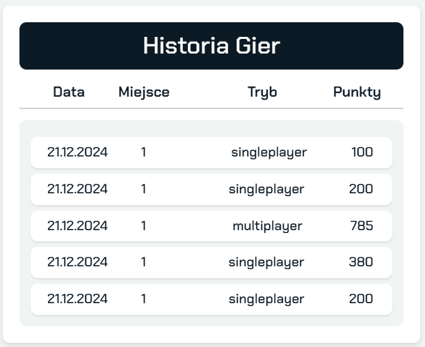</td>
    <td>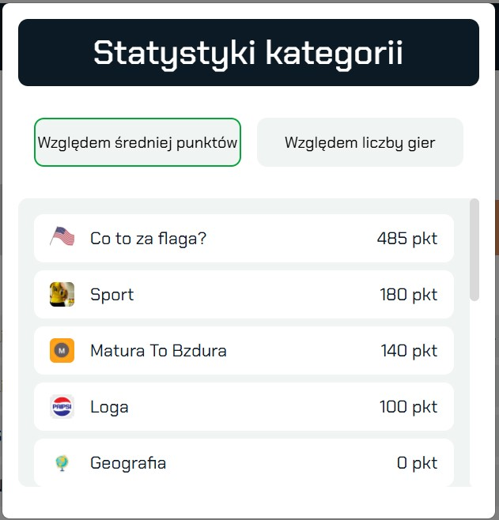</td>
  </tr>
</table>

## Features

### Real-time gameplay

- Private multiplayer rooms with unique six-character codes
- Shareable invitation links
- Automatic matchmaking queue
- Synchronized game state using Socket.IO
- Timed category voting, questions, results and leaderboards
- Score calculation based on correctness and response time
- Player reconnection after a temporary disconnect
- Play-again flow after finishing a match

### Custom game settings

The room owner can configure:

- number of rounds;
- questions per round;
- categories available during voting;
- number of categories displayed during voting;
- answer time;
- maximum number of players;
- enabled power-ups.

Available power-ups:

- **50/50** — removes two incorrect answers;
- **Extend time** — increases the player's answer time;
- **See other answers** — reveals answers already selected by other players.

### Accounts and social features

- Registration and login
- Password hashing with bcrypt
- JWT authentication stored in an HTTP-only cookie
- Temporary guest usernames
- User profiles
- Friends list and online status
- Friend requests
- Real-time notifications
- Direct game invitations

### History and statistics

- Recent multiplayer match history
- Scores and finishing positions
- Total games and total points
- Average and highest score
- Podium-place distribution
- Category-based performance statistics
- Average-score history

### Question management

- Categories with descriptions and images
- Questions with one correct answer and three distractors
- Optional question images
- Pagination by category
- REST endpoints for creating, updating and removing questions

## Architecture

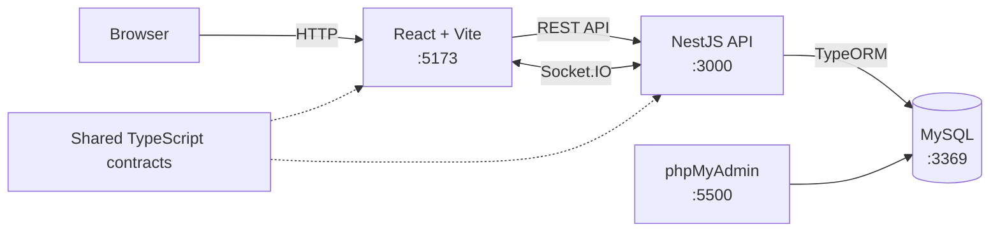

The NestJS backend handles two communication paths:

- **REST** for authentication, users, questions, friends, history and statistics;
- **Socket.IO** for rooms, matchmaking, live gameplay, invitations, friends and notifications.

Active game sessions are maintained by the backend in memory, while users, questions, categories, friendships and completed game results are stored in MySQL.

## Game flow

```text
Waiting room
    ↓
Category voting
    ↓
Selected category preview
    ↓
Timed question
    ↓
Answer result
    ↓
Round leaderboard
    ↓
Next round or game over
```

## Design diagrams

The repository includes selected diagrams from the original engineering documentation. They describe the gameplay process, persisted data and important real-time interactions.

<details>
  <summary><strong>Gameplay BPMN</strong></summary>
  <p align="center">
    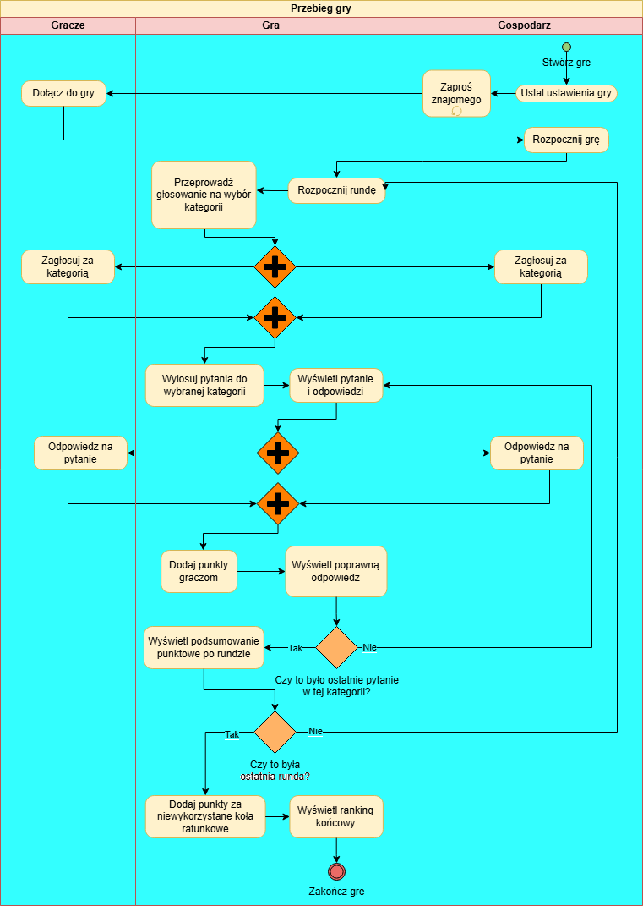
  </p>
</details>

<details>
  <summary><strong>Database ERD</strong></summary>
  <p align="center">
    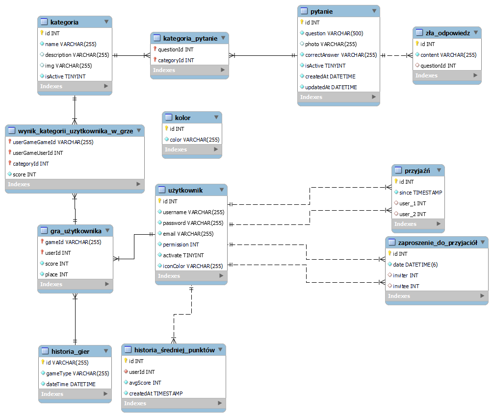
  </p>
</details>

<details>
  <summary><strong>Category voting sequence</strong></summary>
  <p align="center">
    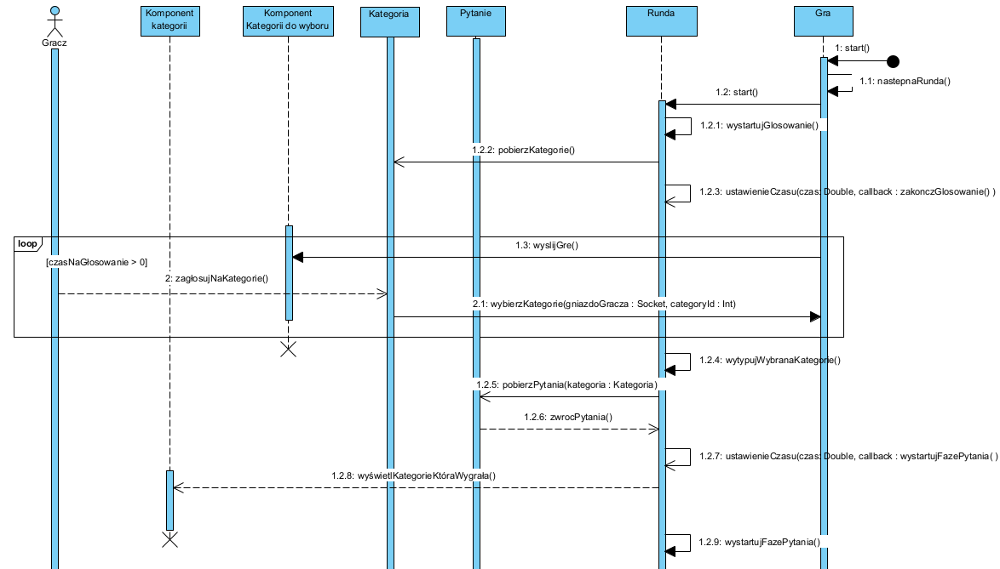
  </p>
</details>

<details>
  <summary><strong>Game invitation sequence</strong></summary>
  <p align="center">
    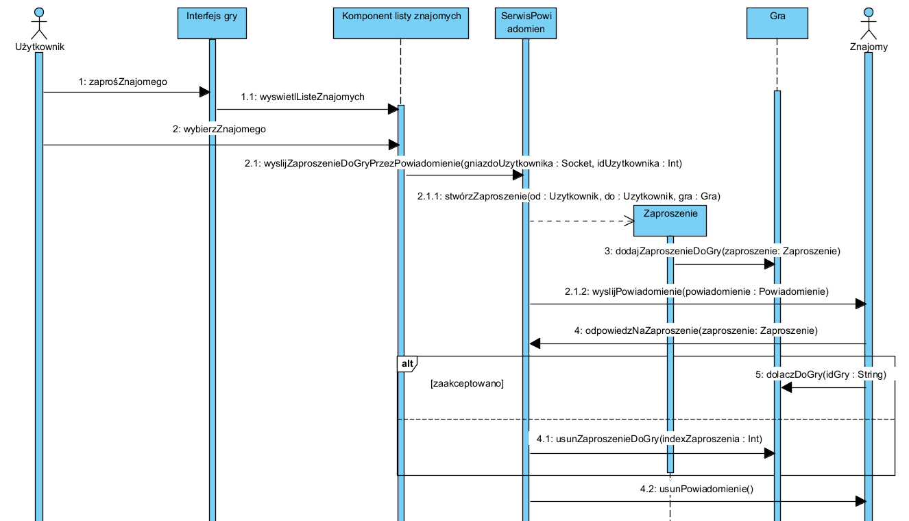
  </p>
</details>

## Technology stack

### Frontend

- React 18 and TypeScript
- Vite
- Redux Toolkit
- React Router
- Socket.IO Client
- Axios
- React Bootstrap and Sass modules
- Formik and Yup
- React Toastify

### Backend

- NestJS 10 and TypeScript
- Socket.IO gateways
- TypeORM
- MySQL2
- JWT and cookie-based authentication
- bcrypt
- class-validator and class-transformer
- Jest and Supertest

### Infrastructure

- Docker Compose
- MySQL
- phpMyAdmin
- npm workspaces

## Project structure

```text
.
├── frontend/                  # React and Vite application
│   ├── public/assets/         # Music and category artwork
│   └── src/
│       ├── api/               # REST API integration
│       ├── pages/             # Game, profile, history and admin views
│       ├── socket/            # Socket.IO client and event handling
│       ├── store/             # Redux state
│       └── styles/            # Global and modular Sass styles
├── backend/                   # NestJS application
│   └── src/
│       ├── auth/              # Authentication and JWT handling
│       ├── friends/           # Friendships and requests
│       ├── game/              # Real-time game engine
│       ├── game-history/      # Results and statistics
│       ├── matchmaking/       # Automatic player matching
│       ├── notifications/     # Invitations and notifications
│       ├── questions/         # Questions and categories
│       └── user/              # User profiles
├── shared/                    # TypeScript contracts shared by both apps
├── docs/
│   ├── diagrams/              # BPMN, ERD and sequence diagrams
│   └── screenshots/           # README gallery images
├── docker-compose.yml         # MySQL and phpMyAdmin
└── package.json               # Workspace scripts
```

## Getting started

### Prerequisites

- Node.js 18 or newer
- npm
- Docker Desktop or Docker Engine with Docker Compose

### 1. Clone the repository

```bash
git clone https://github.com/atakowiec/quiz-app.git
cd quiz-app
```

### 2. Install workspace dependencies

```bash
npm install
```

### 3. Create the backend configuration

Copy the example environment file:

```bash
cp backend/.env.example backend/.env
```

On PowerShell:

```powershell
Copy-Item backend/.env.example backend/.env
```

Use the following local configuration in `backend/.env`:

```dotenv
DB_HOST=localhost
DB_PORT=3369
DB_NAME=quiz_database
DB_USER=quiz_user
DB_PASS=pass
DB_SYNCHRONIZE=true

JWT_SECRET=replace-this-with-a-random-secret
JWT_EXPIRES_IN=365d

CLIENT_PORT=5173
SERVER_PORT=3000

VOTING_TIME=10
SELECTED_CATEGORY_TIME_FIRST=6
SELECTED_CATEGORY_TIME=3
QUESTION_RESULT_TIME=5
```

`DB_SYNCHRONIZE=true` is convenient for local development because TypeORM creates the schema automatically. It should not be used as a replacement for database migrations in production.

### 4. Start the application

The root script starts MySQL, phpMyAdmin, the NestJS backend and the Vite frontend:

```bash
npm start
```

If your environment only provides the modern `docker compose` command, start the services separately:

```bash
docker compose up -d
```

Then run these commands in separate terminals:

```bash
npm run backend:dev
```

```bash
npm run frontend:dev
```

### 5. Open the application

| Service | URL |
|---|---|
| Quiz Base frontend | http://localhost:5173 |
| NestJS API and Socket.IO | http://localhost:3000 |
| phpMyAdmin | http://localhost:5500 |
| MySQL | `localhost:3369` |

The development database credentials are:

```text
Database: quiz_database
User:     quiz_user
Password: pass
```

These credentials are intended only for local development.

## Adding initial questions

The database starts without quiz content. A question can be added through `POST /questions`. Creating a question also creates its category when it does not already exist.

Example request body:

```json
{
  "question": "What is the capital of Poland?",
  "correctAnswer": "Warsaw",
  "distractors": [
    { "content": "Kraków" },
    { "content": "Gdańsk" },
    { "content": "Wrocław" }
  ],
  "category": [
    {
      "name": "Geography",
      "description": "Questions about countries, cities and places",
      "img": "cotozamiejsce.png"
    }
  ]
}
```

The `img` property points to a file inside `frontend/public/assets/categories/`.

## Development commands

Run the frontend:

```bash
npm run frontend:dev
```

Run the backend:

```bash
npm run backend:dev
```

Build the frontend:

```bash
npm run build --workspace=frontend
```

Build the backend:

```bash
npm run build --workspace=backend
```

Run backend tests:

```bash
npm run test --workspace=backend
```

Run end-to-end tests:

```bash
npm run test:e2e --workspace=backend
```

Stop the database services:

```bash
docker compose down
```

## API overview

| Endpoint or event group | Purpose |
|---|---|
| `/auth` | Registration, login, logout, verification and guest usernames |
| `/users` | User lookup and profiles |
| `/friends` | Friend list operations |
| `/questions` | Question and category management |
| `/round` | Random category and question selection |
| `/history` | Match history and player statistics |
| `create_game`, `join_game` | Private room lifecycle |
| `join_queue` | Matchmaking |
| `select_category`, `select_answer` | Live round interaction |
| `use_helper` | Power-up activation |
| `send_game_invite` | Real-time game invitations |

## Contributing

Issues and pull requests are welcome. When contributing, keep the shared TypeScript contracts synchronized with both the frontend and backend event payloads.
